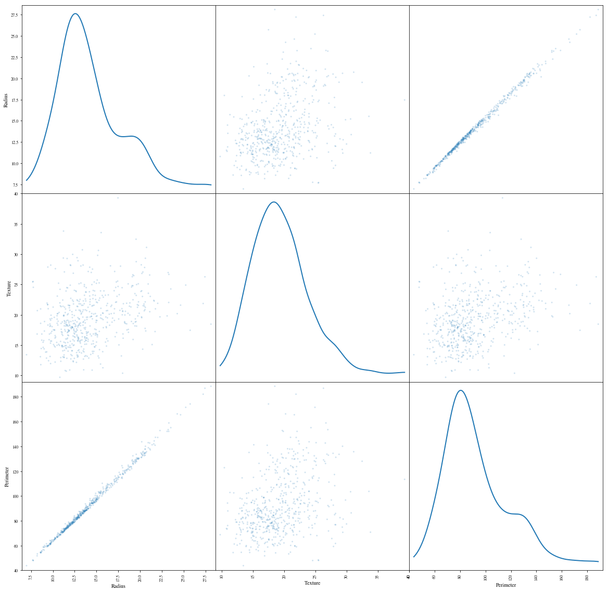
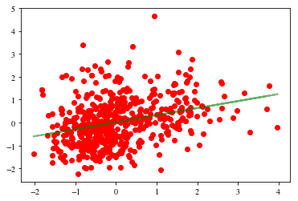
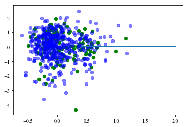
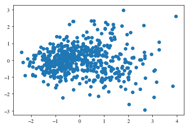
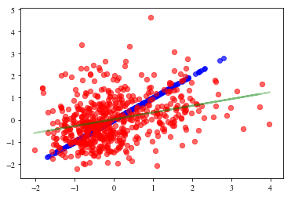
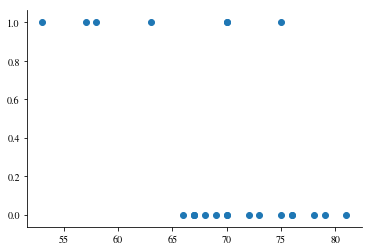
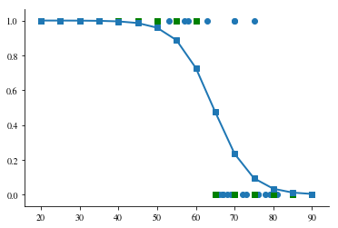
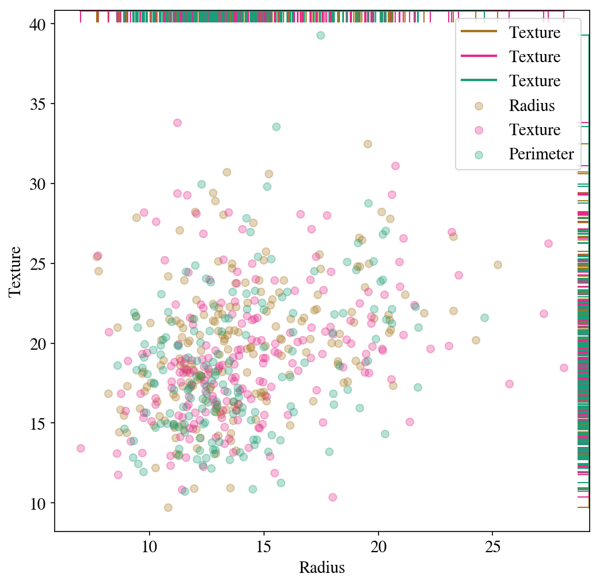

# Homework 2

### Due by 11:59pm on 1 November ( submit within Portfolio )

For each instruction, show your code and execution within the Jupyter Notebook.


```python
#Instruction1: import library and settings
```


```python
%matplotlib inline
from collections import defaultdict
import json

import numpy as np
import scipy as sp
import matplotlib.pyplot as plt
import pandas as pd
from matplotlib import rcParams
import matplotlib.cm as cm
import matplotlib as mpl
#colorbrewer2 Dark2 qualitative color table
dark2_colors = [(0.10588235294117647, 0.6196078431372549, 0.4666666666666667),
                (0.8509803921568627, 0.37254901960784315, 0.00784313725490196),
                (0.4588235294117647, 0.4392156862745098, 0.7019607843137254),
                (0.9058823529411765, 0.1607843137254902, 0.5411764705882353),
                (0.4, 0.6509803921568628, 0.11764705882352941),
                (0.9019607843137255, 0.6705882352941176, 0.00784313725490196),
                (0.6509803921568628, 0.4627450980392157, 0.11372549019607843)]

rcParams['figure.figsize'] = (10, 6)
rcParams['figure.dpi'] = 150

rcParams['lines.linewidth'] = 2
rcParams['axes.facecolor'] = 'white'
#rcParams['axes.color_cycle'] = dark2_colors
rcParams['font.size'] = 14
rcParams['patch.edgecolor'] = 'white'
rcParams['patch.facecolor'] = dark2_colors[0]
rcParams['font.family'] = 'StixGeneral'

def remove_border(axes=None, top=False, right=False, left=True, bottom=True):
    """
    Minimize chartjunk by stripping out unnecesasry plot borders and axis ticks
    
    The top/right/left/bottom keywords toggle whether the corresponding plot border is drawn
    """
    ax = axes or plt.gca()
    ax.spines['top'].set_visible(top)
    ax.spines['right'].set_visible(right)
    ax.spines['left'].set_visible(left)
    ax.spines['bottom'].set_visible(bottom)
    
    #turn off all ticks
    ax.yaxis.set_ticks_position('none')
    ax.xaxis.set_ticks_position('none')
    
    #now re-enable visibles
    if top:
        ax.xaxis.tick_top()
    if bottom:
        ax.xaxis.tick_bottom()
    if left:
        ax.yaxis.tick_left()
    if right:
        ax.yaxis.tick_right()
        
pd.set_option('display.width', 500)
pd.set_option('display.max_columns', 100)

```

#Instruction2: Describe your data set (see hint below):

1) ID number
2) Diagnosis (M = malignant, B = benign)
3-32)

Ten real-valued features are computed for each cell nucleus:

	a) radius (mean of distances from center to points on the perimeter)
	b) texture (standard deviation of gray-scale values)
	c) perimeter
	d) area
	e) smoothness (local variation in radius lengths)
	f) compactness (perimeter^2 / area - 1.0)
	g) concavity (severity of concave portions of the contour)
	h) concave points (number of concave portions of the contour)
	i) symmetry 
	j) fractal dimension ("coastline approximation" - 1)


```python
#Instruction3: Import your dataset and print then number of rows and columns
import pandas as pd
df=pd.read_csv("wdbc.csv")
rows, columns= df.shape
print(rows,columns)
```

    569 12


```python
#Instruction4: Print the names of the features/attributes of your dataset and show the head of the dataset
index=df.index
columns=df.columns
values=df.values
index
columns
```


    Index(['ID_Number', 'Diagnosis', 'Radius', 'Texture', 'Perimeter', 'Area', 'Smoothness', 'Compactness', 'Concavity', 'Comcave_Points', 'Symetry', 'Fractal_dimensions'], dtype='object')


```python
df.head()
```


<div>
<style scoped>
    .dataframe tbody tr th:only-of-type {
        vertical-align: middle;
    }

    .dataframe tbody tr th {
        vertical-align: top;
    }

    .dataframe thead th {
        text-align: right;
    }
</style>
<table border="1" class="dataframe">
  <thead>
    <tr style="text-align: right;">
      <th></th>
      <th>ID_Number</th>
      <th>Diagnosis</th>
      <th>Radius</th>
      <th>Texture</th>
      <th>Perimeter</th>
      <th>Area</th>
      <th>Smoothness</th>
      <th>Compactness</th>
      <th>Concavity</th>
      <th>Comcave_Points</th>
      <th>Symetry</th>
      <th>Fractal_dimensions</th>
    </tr>
  </thead>
  <tbody>
    <tr>
      <th>0</th>
      <td>842302</td>
      <td>M</td>
      <td>17.99</td>
      <td>10.38</td>
      <td>122.80</td>
      <td>1001.0</td>
      <td>0.11840</td>
      <td>0.27760</td>
      <td>0.3001</td>
      <td>0.14710</td>
      <td>0.2419</td>
      <td>0.07871</td>
    </tr>
    <tr>
      <th>1</th>
      <td>842517</td>
      <td>M</td>
      <td>20.57</td>
      <td>17.77</td>
      <td>132.90</td>
      <td>1326.0</td>
      <td>0.08474</td>
      <td>0.07864</td>
      <td>0.0869</td>
      <td>0.07017</td>
      <td>0.1812</td>
      <td>0.05667</td>
    </tr>
    <tr>
      <th>2</th>
      <td>84300903</td>
      <td>M</td>
      <td>19.69</td>
      <td>21.25</td>
      <td>130.00</td>
      <td>1203.0</td>
      <td>0.10960</td>
      <td>0.15990</td>
      <td>0.1974</td>
      <td>0.12790</td>
      <td>0.2069</td>
      <td>0.05999</td>
    </tr>
    <tr>
      <th>3</th>
      <td>84348301</td>
      <td>M</td>
      <td>11.42</td>
      <td>20.38</td>
      <td>77.58</td>
      <td>386.1</td>
      <td>0.14250</td>
      <td>0.28390</td>
      <td>0.2414</td>
      <td>0.10520</td>
      <td>0.2597</td>
      <td>0.09744</td>
    </tr>
    <tr>
      <th>4</th>
      <td>84358402</td>
      <td>M</td>
      <td>20.29</td>
      <td>14.34</td>
      <td>135.10</td>
      <td>1297.0</td>
      <td>0.10030</td>
      <td>0.13280</td>
      <td>0.1980</td>
      <td>0.10430</td>
      <td>0.1809</td>
      <td>0.05883</td>
    </tr>
  </tbody>
</table>
</div>


```python
#Instruction5: Use a SPLOM to visualize some columns of this dataset. In Panda's the SPLOM is a one-liner.
from pandas.plotting import scatter_matrix
dff=df[['Radius','Texture','Perimeter']]
scatter_matrix(dff, alpha = 0.2, figsize = (20, 20), diagonal = 'kde')

```


    array([[<matplotlib.axes._subplots.AxesSubplot object at 0x113aa6550>,
            <matplotlib.axes._subplots.AxesSubplot object at 0x1139ebb00>,
            <matplotlib.axes._subplots.AxesSubplot object at 0x10e5071d0>],
           [<matplotlib.axes._subplots.AxesSubplot object at 0x10e52c860>,
            <matplotlib.axes._subplots.AxesSubplot object at 0x10e554ef0>,
            <matplotlib.axes._subplots.AxesSubplot object at 0x10e554f28>],
           [<matplotlib.axes._subplots.AxesSubplot object at 0x113a65c50>,
            <matplotlib.axes._subplots.AxesSubplot object at 0x113c82320>,
            <matplotlib.axes._subplots.AxesSubplot object at 0x113caa9b0>]],
          dtype=object)





```python
#Instruction6: Are there any strong correlation between any of the features.  Run a correlation analysis on the three 
#features.
dff.corr()
```


<div>
<style scoped>
    .dataframe tbody tr th:only-of-type {
        vertical-align: middle;
    }

    .dataframe tbody tr th {
        vertical-align: top;
    }

    .dataframe thead th {
        text-align: right;
    }
</style>
<table border="1" class="dataframe">
  <thead>
    <tr style="text-align: right;">
      <th></th>
      <th>Radius</th>
      <th>Texture</th>
      <th>Perimeter</th>
    </tr>
  </thead>
  <tbody>
    <tr>
      <th>Radius</th>
      <td>1.000000</td>
      <td>0.323782</td>
      <td>0.997855</td>
    </tr>
    <tr>
      <th>Texture</th>
      <td>0.323782</td>
      <td>1.000000</td>
      <td>0.329533</td>
    </tr>
    <tr>
      <th>Perimeter</th>
      <td>0.997855</td>
      <td>0.329533</td>
      <td>1.000000</td>
    </tr>
  </tbody>
</table>
</div>


```python
#Instruction7: Carry out the regression, first standardizing our variables. This is strictly not necessary, but we are doing it as we wish to play around with PCA. 
#Since scikit-learn wants a n_sample rows times n_features matrix, we need to reshape the x variable. We store both an _vec variable, which is easier to plot with, 
#as well as the reshaped variable. 
from sklearn.linear_model import LinearRegression
X_HD=df[['Radius', 'Texture']].values
X_HDn=(X_HD - X_HD.mean(axis=0))/X_HD.std(axis=0)
RAD_std_vec=X_HDn[:,0]
RAD_std=RAD_std_vec.reshape(-1,1)
TEXT_std_vec=X_HDn[:,1]
TEXT_std=TEXT_std_vec.reshape(-1,1)

```


```python
#Instruction8: Split the data into a training set and a testing set. By default, 25% of the data is reserved for 
#testing. 
from sklearn.model_selection import train_test_split
X_train, X_test, y_train, y_test = train_test_split(RAD_std, TEXT_std_vec)

```


```python
#Instrusction9: Use the training set for the fit, and find what our predictions ought to be on both the training and 
#test set.
clf1 = LinearRegression()
clf1.fit(X_train, y_train)
predicted_train = clf1.predict(X_train)
predicted_test = clf1.predict(X_test)
trains=X_train.reshape(1,-1).flatten()
tests=X_test.reshape(1,-1).flatten()
print (clf1.coef_, clf1.intercept_)

```

    [0.30676271] 0.019180114055572114


```python
#Instruction10: Plot the scatter against the fit for both training and test data.
plt.scatter(RAD_std_vec, TEXT_std_vec,c='r')
plt.plot(trains, predicted_train, c='g', alpha=0.5)
plt.plot(tests, predicted_test, c='g', alpha=0.2)

```


    [<matplotlib.lines.Line2D at 0x1a213b8940>]





```python
#Instruction11: Look at the residuals, again on both sets.
plt.scatter(predicted_test, predicted_test- y_test, c='g', s=40)
plt.scatter(predicted_train, predicted_train- y_train, c='b', s=40, alpha=0.5)
plt.plot([0.4,2],[0,0])

```


    [<matplotlib.lines.Line2D at 0x1a216e6ba8>]





```python
#Instruction12: Take the standarddized data and do a 2-D PCA on it. 
#Here we do not seek to accomplish a dimensional reduction, but to understand the variance structure of the data.
clf1.score(X_train, y_train), clf1.score(X_test, y_test)

```


    (0.09282242397615835, 0.1386902063500245)


```python
from sklearn.decomposition import PCA
pca = PCA(n_components=2)
X = pca.fit_transform(X_HDn)
print (pca.explained_variance_ratio_)
plt.scatter(X[:, 0], X[:, 1])
```

    [0.66189095 0.33810905]


    <matplotlib.collections.PathCollection at 0x1a21770b38>





```python
#Instruction13: Reconstruct the original data from only the first component, setting the others to 0.
pca1 = PCA(n_components=1) # only keep one dimension!
X_E = pca1.fit_transform(X_HDn)
X_reconstructed = pca1.inverse_transform(X_E)

```


```python
#Instruction14: Plot the reconstructed education(x) and income(y) from the first principal component, in blue.
plt.scatter(X_reconstructed[:,0], X_reconstructed[:,1],c='b', s=35, alpha=0.7)
plt.scatter(RAD_std_vec, TEXT_std_vec, s=40, c='r', alpha=0.6)
plt.plot(trains, predicted_train, c='g', alpha=0.3)
plt.plot(tests, predicted_test, c='g', alpha=0.3)

```


    [<matplotlib.lines.Line2D at 0x1a21881f60>]





```python
#Part2: Logistic Regression Instuctions
```


```python
#Instruction1: Load the array
data=np.array([[ 66.,   0.],
       [ 70.,   1.],
       [ 69.,   0.],
       [ 68.,   0.],
       [ 67.,   0.],
       [ 72.,   0.],
       [ 73.,   0.],
       [ 70.,   0.],
       [ 57.,   1.],
       [ 63.,   1.],
       [ 70.,   1.],
       [ 78.,   0.],
       [ 67.,   0.],
       [ 53.,   1.],
       [ 67.,   0.],
       [ 75.,   0.],
       [ 70.,   0.],
       [ 81.,   0.],
       [ 76.,   0.],
       [ 79.,   0.],
       [ 75.,   1.],
       [ 76.,   0.],
       [ 58.,   1.]])
```


```python
#Instruction2: Plot the array.
temps, pfail = data[:,0], data[:,1]
plt.scatter(temps, pfail)
axes=plt.gca()
axes.grid(False)
remove_border(axes)

```





```python
#Instruction3: Run Logistic Regression with sklearn.linear_model and set c to 1000.
from sklearn.linear_model import LogisticRegression
reg=1000.
clf4 = LogisticRegression(C=reg)
clf4.fit(temps.reshape(-1,1), pfail)


```


    LogisticRegression(C=1000.0, class_weight=None, dual=False,
              fit_intercept=True, intercept_scaling=1, max_iter=100,
              multi_class='ovr', n_jobs=1, penalty='l2', random_state=None,
              solver='liblinear', tol=0.0001, verbose=0, warm_start=False)


```python
#Instruction4: Make predictions, get the associated probabilities, and plot them.
tempsnew=np.linspace(20., 90., 15)
probs = clf4.predict_proba(tempsnew.reshape(-1,1))[:, 1]
predicts = clf4.predict(tempsnew.reshape(-1,1))
```


```python
plt.scatter(temps, pfail)
axes=plt.gca()
axes.grid(False)
remove_border(axes)
plt.plot(tempsnew, probs, marker='s')
plt.scatter(tempsnew, predicts, marker='s', color="green")
```


    <matplotlib.collections.PathCollection at 0x1a21bdc208>





```python
#Instruction5: use pandas crosstab to write a table of prediction vs failure on the "training" set.
pd.crosstab(pfail, clf4.predict(temps.reshape(-1,1)), rownames=["Actual"], colnames=["Predicted"])

```


<div>
<style scoped>
    .dataframe tbody tr th:only-of-type {
        vertical-align: middle;
    }

    .dataframe tbody tr th {
        vertical-align: top;
    }

    .dataframe thead th {
        text-align: right;
    }
</style>
<table border="1" class="dataframe">
  <thead>
    <tr style="text-align: right;">
      <th>Predicted</th>
      <th>0.0</th>
      <th>1.0</th>
    </tr>
    <tr>
      <th>Actual</th>
      <th></th>
      <th></th>
    </tr>
  </thead>
  <tbody>
    <tr>
      <th>0.0</th>
      <td>16</td>
      <td>0</td>
    </tr>
    <tr>
      <th>1.0</th>
      <td>3</td>
      <td>4</td>
    </tr>
  </tbody>
</table>
</div>


```python
#Part3: Bias and Variance and Cross Validation

```


```python
# Instruction1: Load the settings needed for part3

%matplotlib inline
import numpy as np
import matplotlib.pyplot as plt
import pandas as pd
import brewer2mpl

from matplotlib import rcParams

#colorbrewer2 Dark2 qualitative color table
dark2_cmap = brewer2mpl.get_map('Dark2', 'Qualitative', 7)
dark2_colors = dark2_cmap.mpl_colors

rcParams['figure.figsize'] = (10, 6)
rcParams['figure.dpi'] = 150
#rcParams['axes.color_cycle'] = dark2_colors
rcParams['lines.linewidth'] = 2
rcParams['axes.facecolor'] = 'white'
rcParams['font.size'] = 14
rcParams['patch.edgecolor'] = 'white'
rcParams['patch.facecolor'] = dark2_colors[0]
rcParams['font.family'] = 'StixGeneral'


def remove_border(axes=None, top=False, right=False, left=True, bottom=True):
    """
    Minimize chartjunk by stripping out unnecesasry plot borders and axis ticks
    
    The top/right/left/bottom keywords toggle whether the corresponding plot border is drawn
    """
    ax = axes or plt.gca()
    ax.spines['top'].set_visible(top)
    ax.spines['right'].set_visible(right)
    ax.spines['left'].set_visible(left)
    ax.spines['bottom'].set_visible(bottom)
    
    #turn off all ticks
    ax.yaxis.set_ticks_position('none')
    ax.xaxis.set_ticks_position('none')
    
    #now re-enable visibles
    if top:
        ax.xaxis.tick_top()
    if bottom:
        ax.xaxis.tick_bottom()
    if left:
        ax.yaxis.tick_left()
    if right:
        ax.yaxis.tick_right()
        
pd.set_option('display.width', 500)
pd.set_option('display.max_columns', 100)
import warnings
warnings.filterwarnings('ignore', message='Polyfit*')
```


```python
import random
import random
import copy
def scatter_by(df, scatterx, scattery, by=None, figure=None, axes=None, colorscale=dark2_cmap, labeler={}, mfunc=None, setupfunc=None, mms=8):
    cs=copy.deepcopy(colorscale.mpl_colors)
    if not figure:
        figure=plt.figure(figsize=(8,8))
    if not axes:
        axes=figure.gca()
    x=df[scatterx]
    y=df[scattery]
    if not by:
        col=random.choice(cs)
        axes.scatter(x, y, cmap=colorscale, c=col)
        if setupfunc:
            axeslist=setupfunc(axes, figure)
        else:
            axeslist=[axes]
        if mfunc:
            mfunc(axeslist,x,y,color=col, mms=mms)
    else:
        cs=list(np.linspace(0,1,len(df.groupby(by))))
        xlimsd={}
        ylimsd={}
        xs={}
        ys={}
        cold={}
        for k,g in df.groupby(by):
            col=cs.pop()
            x=g[scatterx]
            y=g[scattery]
            xs[k]=x
            ys[k]=y
            c=colorscale.mpl_colormap(col)
            cold[k]=c
            axes.scatter(x, y, c=c, label=labeler.get(k,k), s=40, alpha=0.3);
            xlimsd[k]=axes.get_xlim()
            ylimsd[k]=axes.get_ylim()
        xlims=[min([xlimsd[k][0] for k in xlimsd.keys()]), max([xlimsd[k][1] for k in xlimsd.keys()])]
        ylims=[min([ylimsd[k][0] for k in ylimsd.keys()]), max([ylimsd[k][1] for k in ylimsd.keys()])]
        axes.set_xlim(xlims)
        axes.set_ylim(ylims)
        if setupfunc:
            axeslist=setupfunc(axes, figure)
        else:
            axeslist=[axes]
        if mfunc:
            for k in xs.keys():
                mfunc(axeslist,xs[k],ys[k],color=cold[k], mms=mms);
    axes.set_xlabel(scatterx);
    axes.set_ylabel(scattery);
    
    return axes

def make_rug(axeslist, x, y, color='b', mms=8):
    axes=axeslist[0]
    zerosx1=np.zeros(len(x))
    zerosx2=np.zeros(len(x))
    xlims=axes.get_xlim()
    ylims=axes.get_ylim()
    zerosx1.fill(ylims[1])
    zerosx2.fill(xlims[1])
    axes.plot(x, zerosx1, marker='|', color=color, ms=mms)
    axes.plot(zerosx2, y, marker='_', color=color, ms=mms)
    axes.set_xlim(xlims)
    axes.set_ylim(ylims)
    return axes
```


```python
#Instruction2: Load your dataset
import pandas as pd
df=pd.read_csv("wdbc.csv")
print(len(df.columns))
print(len(df.index))
```

    12
    569


```python
#Instruction3: Split the data set into equal parts test and training using the std vectors from Part1
from sklearn.model_selection import train_test_split
X_train, X_test, y_train, y_test = train_test_split(RAD_std, TEXT_std_vec)


```


```python
#Instruction4: Create a column called "class" and randomly add a "1", "2", or "3" for every row.
#e.g.
#featueA | Class
#--- | ---
#9 | 1
#5 | 2
#7 | 3
#6 | 2
#3 | 1
#6 | 3

df['randNumCol'] = np.random.randint(1, 4, df.shape[0])
print(df.columns)
```

    Index(['ID_Number', 'Diagnosis', 'Radius', 'Texture', 'Perimeter', 'Area', 'Smoothness', 'Compactness', 'Concavity', 'Comcave_Points', 'Symetry', 'Fractal_dimensions', 'randNumCol'], dtype='object')


```python
#Instruction5: Choose three different features in your dataset and cluster them by the randomNumCol
akeys=[1,2,3]
avals=['Radius','Texture','Perimeter']
amap={e[0]:e[1] for e in zip(akeys,avals)}
ax=scatter_by(df, 'Radius', 'Texture', by='randNumCol', labeler=amap, mfunc=make_rug, mms=20)
ax.grid(False)
ax.legend(loc='upper right');

```





```python
#Instructin6: Add plotting settings
from matplotlib.colors import ListedColormap
#cm_bright = ListedColormap(['#FF0000', '#000000','#0000FF'])
#cm = plt.cm.RdBu
cmap_light = ListedColormap(['#FFAAAA', '#AAFFAA', '#AAAAFF'])
cmap_bold = ListedColormap(['#FF0000', '#00FF00', '#0000FF'])

def points_plot(X, Xtr, Xte, ytr, yte, clf, colorscale=cmap_light, cdiscrete=cmap_bold):
    h = .02
    x_min, x_max = X[:, 0].min() - .5, X[:, 0].max() + .5
    y_min, y_max = X[:, 1].min() - .5, X[:, 1].max() + .5
    xx, yy = np.meshgrid(np.linspace(x_min, x_max, 50),
                         np.linspace(y_min, y_max, 50))

    plt.figure()
    Z = clf.predict(np.c_[xx.ravel(), yy.ravel()])
    Z = Z.reshape(xx.shape)
    plt.pcolormesh(xx, yy, Z, cmap=cmap_light, alpha=0.2)
    plt.scatter(Xtr[:, 0], Xtr[:, 1], c=ytr-1, cmap=cdiscrete, s=50, alpha=0.2,edgecolor="k")
    # and testing points
    yact=clf.predict(Xte)
    print ("SCORE"), clf.score(Xte, yte)
    plt.scatter(Xte[:, 0], Xte[:, 1], c=yte-1, cmap=cdiscrete, alpha=0.5, marker="s", s=35)
    plt.xlim(xx.min(), xx.max())
    plt.ylim(yy.min(), yy.max())
    return ax
```


```python
#Instruction7: Develop a kNN with 20 neighbors
from sklearn.neighbors import KNeighborsClassifier
subdf=df[['Radius','Texture']]
subdfstd=(subdf - subdf.mean())/subdf.std()
X=subdfstd.values
y=df['randNumCol'].values
Xtrain, Xtest, ytrain, ytest = train_test_split(X, y, train_size=0.6)
Xtr=np.concatenate((Xtrain, Xtest))
```

    /Users/sadiqatarar/anaconda3/lib/python3.6/site-packages/sklearn/model_selection/_split.py:2026: FutureWarning: From version 0.21, test_size will always complement train_size unless both are specified.
      FutureWarning)


```python
#Instruction8: Plot the kNN model with 20 neighbors
clf = KNeighborsClassifier(20, warn_on_equidistant=False).fit(Xtrain, ytrain)
points_plot(Xtr, Xtrain, Xtest, ytrain, ytest, clf)

```


    ---------------------------------------------------------------------------

    TypeError                                 Traceback (most recent call last)

    <ipython-input-53-a29251123db6> in <module>()
          1 #Instruction8: Plot the kNN model with 20 neighbors
    ----> 2 clf = KNeighborsClassifier(20, warn_on_equidistant=False).fit(Xtrain, ytrain)
          3 #clf = KNeighborsClassifier(20,warn_on_equidistant=False, p=p[params.keys().index('p')])
          4 points_plot(Xtr, Xtrain, Xtest, ytrain, ytest, clf)


    ~/anaconda3/lib/python3.6/site-packages/sklearn/neighbors/classification.py in __init__(self, n_neighbors, weights, algorithm, leaf_size, p, metric, metric_params, n_jobs, **kwargs)
        124                           algorithm=algorithm,
        125                           leaf_size=leaf_size, metric=metric, p=p,
    --> 126                           metric_params=metric_params, n_jobs=n_jobs, **kwargs)
        127         self.weights = _check_weights(weights)
        128 


    TypeError: _init_params() got an unexpected keyword argument 'warn_on_equidistant'


```python
##Instruction9: Plot the kNN model with 1 neighbors
clf = KNeighborsClassifier(1, warn_on_equidistant=False).fit(Xtrain, ytrain)
points_plot(Xtr, Xtrain, Xtest, ytrain, ytest, clf)
```


    ---------------------------------------------------------------------------

    TypeError                                 Traceback (most recent call last)

    <ipython-input-48-3e60066f2bca> in <module>()
          1 ##Instruction9: Plot the kNN model with 1 neighbors
    ----> 2 clf = KNeighborsClassifier(1, warn_on_equidistant=False).fit(Xtrain, ytrain)
          3 points_plot(Xtr, Xtrain, Xtest, ytrain, ytest, clf)


    ~/anaconda3/lib/python3.6/site-packages/sklearn/neighbors/classification.py in __init__(self, n_neighbors, weights, algorithm, leaf_size, p, metric, metric_params, n_jobs, **kwargs)
        124                           algorithm=algorithm,
        125                           leaf_size=leaf_size, metric=metric, p=p,
    --> 126                           metric_params=metric_params, n_jobs=n_jobs, **kwargs)
        127         self.weights = _check_weights(weights)
        128 


    TypeError: _init_params() got an unexpected keyword argument 'warn_on_equidistant'


```python
##Instruction10: Plot the kNN model with 35 neighbors
clf = KNeighborsClassifier(35, warn_on_equidistant=False).fit(Xtrain, ytrain)
points_plot(Xtr, Xtrain, Xtest, ytrain, ytest, clf)
```


    ---------------------------------------------------------------------------

    TypeError                                 Traceback (most recent call last)

    <ipython-input-49-1ece2d92d232> in <module>()
          1 ##Instruction10: Plot the kNN model with 35 neighbors
    ----> 2 clf = KNeighborsClassifier(35, warn_on_equidistant=False).fit(Xtrain, ytrain)
          3 points_plot(Xtr, Xtrain, Xtest, ytrain, ytest, clf)


    ~/anaconda3/lib/python3.6/site-packages/sklearn/neighbors/classification.py in __init__(self, n_neighbors, weights, algorithm, leaf_size, p, metric, metric_params, n_jobs, **kwargs)
        124                           algorithm=algorithm,
        125                           leaf_size=leaf_size, metric=metric, p=p,
    --> 126                           metric_params=metric_params, n_jobs=n_jobs, **kwargs)
        127         self.weights = _check_weights(weights)
        128 


    TypeError: _init_params() got an unexpected keyword argument 'warn_on_equidistant'


```python
#Instruction 11:
# a) Develop a function to run KNN with a k from 1-80.  Split the data set into test and training and then
# plot the accuracies of the training set vs. the test set for all 80 test runs.
# b) Use "from sklearn.grid_search import GridSearchCV"  and "from sklearn.metrics import classification_report
#  to print the precision, recall, f1-score, and support
# c) Creat a plot using the GridSearchCV values. 

Xtrain, Xtest, ytrain, ytest = train_test_split(X, y, train_size=0.8)
Xtr=np.concatenate((Xtrain, Xtest))
from sklearn.grid_search import GridSearchCV
from sklearn.metrics import classification_report
parameters = {"n_neighbors": np.arange(1,80,1)}
clf = KNeighborsClassifier(warn_on_equidistant=False)
gs = GridSearchCV(clf, param_grid=parameters, cv=10)
gs.fit(Xtrain, ytrain)

#print gs.grid_scores_
print (gs.best_params_, gs.best_score_)
y_true, y_pred = ytest, gs.predict(Xtest)
print(classification_report(y_true, y_pred))

```

    /Users/sadiqatarar/anaconda3/lib/python3.6/site-packages/sklearn/model_selection/_split.py:2026: FutureWarning: From version 0.21, test_size will always complement train_size unless both are specified.
      FutureWarning)
    /Users/sadiqatarar/anaconda3/lib/python3.6/site-packages/sklearn/cross_validation.py:41: DeprecationWarning: This module was deprecated in version 0.18 in favor of the model_selection module into which all the refactored classes and functions are moved. Also note that the interface of the new CV iterators are different from that of this module. This module will be removed in 0.20.
      "This module will be removed in 0.20.", DeprecationWarning)
    /Users/sadiqatarar/anaconda3/lib/python3.6/site-packages/sklearn/grid_search.py:42: DeprecationWarning: This module was deprecated in version 0.18 in favor of the model_selection module into which all the refactored classes and functions are moved. This module will be removed in 0.20.
      DeprecationWarning)


    ---------------------------------------------------------------------------

    TypeError                                 Traceback (most recent call last)

    <ipython-input-51-707dcc35d72f> in <module>()
         11 from sklearn.metrics import classification_report
         12 parameters = {"n_neighbors": np.arange(1,80,1)}
    ---> 13 clf = KNeighborsClassifier(warn_on_equidistant=False)
         14 gs = GridSearchCV(clf, param_grid=parameters, cv=10)
         15 gs.fit(Xtrain, ytrain)


    ~/anaconda3/lib/python3.6/site-packages/sklearn/neighbors/classification.py in __init__(self, n_neighbors, weights, algorithm, leaf_size, p, metric, metric_params, n_jobs, **kwargs)
        124                           algorithm=algorithm,
        125                           leaf_size=leaf_size, metric=metric, p=p,
    --> 126                           metric_params=metric_params, n_jobs=n_jobs, **kwargs)
        127         self.weights = _check_weights(weights)
        128 


    TypeError: _init_params() got an unexpected keyword argument 'warn_on_equidistant'

